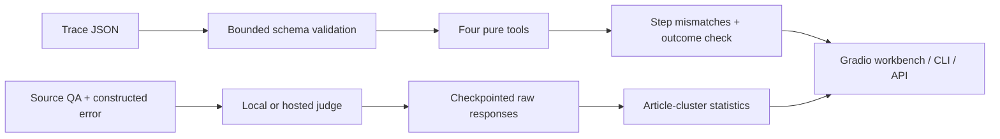

# JudgeGuard

### A correct answer can hide a broken agent trace.

JudgeGuard is an **evaluation workbench for agent tool traces and LLM judges**.
Replay a trace, find the exact inconsistent call, and inspect real judge responses
against source-supported answers. The public demo runs without API keys.

[One-page case study (PDF)](docs/case-study.pdf)

[](https://github.com/RyanSingh0/judgeguard/actions/workflows/ci.yml)
[](https://github.com/RyanSingh0/judgeguard/actions/workflows/eval.yml)
[](pyproject.toml)
[](LICENSE)

**[Open the interactive workbench →](https://huggingface.co/spaces/RugFace/judgeguard-app)**
· [Measured results](results/pilot_live.json)
· [Raw responses](results/pilot-evidence/judgments.jsonl)
· [Release scope](docs/release.md)

## Try the 30-second demo

1. Open **Audit an agent trace** and load **Wrong argument, correct final answer**.
2. Run the audit. The supplied final answer matches, but `4200 * 28.5` replays as
   `119700`, not the recorded `115500`. The workbench flags the exact step.
3. Switch to **Inspect the real model benchmark**. Inspect the steam-engine case:
   the source says `3600`, the corrupted answer says `3960`, and Qwen rated both 9/10.

The first tab executes real deterministic checks on constructed traces. The second
shows **saved real-model evidence**, not a new inference call. Neither is simulated.

The **Try a live model** tab runs Qwen3-0.6B on ZeroGPU with your source, question
and answer. This is an uncalibrated model opinion, not the Qwen3-4B benchmark or a
blocking decision. It reports the model revision, token counts and finish reason.
Only live inference uses ZeroGPU quota; trace replay and evidence browsing do not.

## What is implemented

| Capability | What you can do |
|---|---|
| Agent trace replay | Paste/edit JSON; check declared tools, arguments, recorded results and an optional expected final answer. |
| Failure analysis | Locate wrong arguments, fabricated results and unsupported tools; distinguish a matching answer from a consistent execution. |
| Real evidence explorer | Inspect all 100 QA pairs, the four failures, source passages, judge rationales and raw metadata. |
| Live GPU judge | Try Qwen3-0.6B against an editable source and answer; inspect its raw opinion and provenance. |
| Local evaluation runner | Run a local or configured hosted model with bounded judgments, checkpoints and resume. |
| CLI and API | Audit with `judgeguard audit-trace` or `POST /audit`; access the measured report at `/benchmark`. |
| Reproducibility | Pinned model revision, checksums, raw responses, locked dependencies, tests, and separate release/promotion checks. |

Supported tools: `lookup`, `calculator`, `date_diff`, `unit_convert`. These are pure
functions over a fixed demo environment. The auditor never executes arbitrary Python,
shell commands or network tools. Inputs and trace lengths are bounded.

Calls are replayed **independently**. Matching outputs do not prove that all required
steps were included or that the agent chose an appropriate plan. The optional
expected answer is a caller-supplied oracle, not ground truth invented by the auditor.

## Real-model pilot

**Question:** can a small local judge rank a source-supported numeric answer above
a deliberately corrupted one?

| Measurement | Result |
|---|---:|
| Model | Qwen3-4B · Q4_K_M |
| Dataset | 100 numeric QA pairs from 28 SQuAD v2 articles |
| Actual judge responses | 200 |
| Correct rankings | **96 / 100** |
| 95% article-cluster bootstrap interval | **92.45%–99.03%** |
| Ties / parsing failures | 4 / 0 |
| Prompt / output tokens | 87,238 / 9,459 |
| Paid API charges | **$0**, on an existing RTX 4060 Laptop GPU |

Ties and parsing failures count as failures. All four ties remain in the dataset
and appear first in the explorer. For one ambiguous question the model also
questioned the reference wording; that case needs human review, not silent deletion.

This is a **narrow constructed-error pilot**, not general RAG accuracy, an agent
benchmark or a claim about hosted models. Public-benchmark contamination is possible.
Labels have automatic source-span checks; independent human review remains pending.
Local inference still consumes electricity and existing hardware.

## Run locally

```bash
git clone https://github.com/RyanSingh0/judgeguard.git
cd judgeguard
uv sync --locked --extra dev --extra demo --python 3.12
uv run --no-sync python gradio_app.py
```

Open `http://localhost:7860`. No key or model download is required for the workbench.

```bash
# Exit 1 means an inconsistent trace was detected, not a CLI crash.
uv run --no-sync judgeguard audit-trace data/example-trace.json

# FastAPI service; interactive docs at localhost:8080/docs.
uv run --no-sync judgeguard serve --host 127.0.0.1 --port 8080

# Software and frozen evidence checks; no live model calls.
uv run --no-sync pytest
uv run --no-sync python scripts/verify_pilot.py
```

To collect fresh model responses, use the pinned local-model setup and resumable
runner in the [completion guide](docs/completion.md). Free provider aggregators still
have quotas; local inference is the repeatable route used for this pilot.

## Architecture



## Release checks are not model-promotion approval

**CI** checks software, types, browser parity and the Docker service.
**Evidence and replay** validates raw-response integrity, recomputes the published
pilot, tests replay behavior and checks the demo bundle. It is a frozen-evidence
regression check, not fresh model inference on each commit.

The separate manual **student-promotion** workflow retrains the experimental student
and retains strict blocking-quality requirements. **It currently fails**:

| Corrected 200-item rebuild, held-out sources | Measured | Required |
|---|---:|---:|
| Accuracy | 56.25% | ≥70% |
| Block precision | 54.39% | ≥90% |
| False-block rate | 65.0% | ≤5% |

See the [preserved failed report](results/student_promotion.json). The student is
**not approved for production blocking** and is not part of the public Gradio demo's
decisions. Its source and legacy API remain available for research. No thresholds
were relaxed to make a badge green.

The original four-judge study and figures are **historical simulations**, preserved
in `results/` and older research documents. They must not be cited as measured
Gemini, Llama, Qwen or GPT performance. The real pilot is identified separately.

## Deploy and extend

The public deployment uses **Gradio on the account's free ZeroGPU hosting option**.
ZeroGPU requires an actual GPU function. The optional live judge supplies it;
replay and saved evidence remain CPU-only. Free queues and daily GPU quotas apply.
See [deployment instructions](docs/release.md).

For a stronger study, add permission-cleared domain examples, naturally occurring
agent failures, complete tool observations and independently reviewed labels.
Separate source documents before training/calibration/testing. The small replay
environment is a starting point for adapters, not a universal trace validator.

**Licensing:** code MIT; SQuAD-derived dataset CC BY-SA 4.0 with
[attribution and mutation records](data/README.md); Qwen weights Apache-2.0 (not included).

Built by **Aryan Meena** · [GitHub](https://github.com/RyanSingh0)
