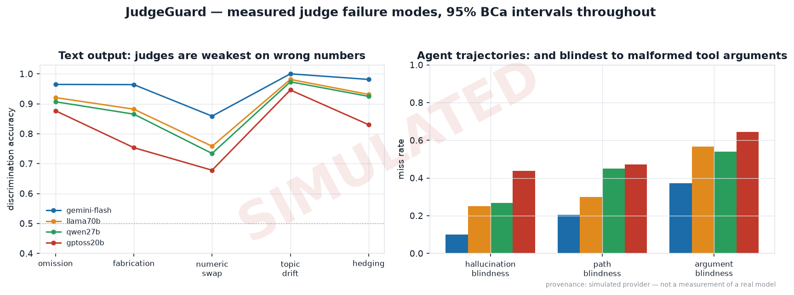

<div align="center">

# JudgeGuard

### Can you trust the judge?

**Everyone building with LLMs uses an LLM to grade the output. Almost nobody measures whether
the grader is any good.**

JudgeGuard manufactures ground truth without annotators, probes LLM judges for known biases with
a confidence interval on every number, extends the method to *agent trajectories* — and ships the
calibrated judge as an inline guardrail with a hard latency budget.

[](https://github.com/RyanSingh0/judgeguard/actions/workflows/ci.yml)
[](https://github.com/RyanSingh0/judgeguard/actions/workflows/eval.yml)
[](pyproject.toml)
[](https://docs.astral.sh/uv/)
[](https://github.com/astral-sh/ruff)
[](LICENSE)

</div>

---

## The finding

> **Judges failed to detect malformed tool arguments in 37.2% to 64.4% of agent trajectories**
> (best judge: detection 62.8%, 95% CI [55.6, 69.4]; worst: 35.6%, 95% CI [28.9, 42.8])
> — a failure class that output-only evaluation cannot reach by construction.



---

## Three findings

**1. Judges are blindest to the errors that look most fluent.**
Changing `11.7%` to `15.2%` leaves the prose untouched and makes the answer false — and the value
is stated verbatim in the source document the judge was given. It was still the worst-detected
error class for **all four** judges (67.8%–85.9%), while an obviously off-topic answer was caught
95–100% of the time. At a subtle 4% perturbation the best judge sat at 66.2% [62.0, 70.4] and the
weakest at 54.8% [50.4, 59.0] — an interval reaching down toward coin-flip territory. Detection
tracks how much *surface* the error disturbs, not how much *meaning* it destroys.

**2. On agent trajectories the gap becomes a hole — and swapping the options changes the answer.**
Malformed tool arguments went undetected 37.2%–64.4% of the time, far worse than a call to a tool
that does not exist (10.0%–43.9%), even though the action space is printed in the prompt.
Separately, the weakest judge **reversed its own verdict on 32.3% [30.8, 33.8] of pairwise
comparisons purely because the two options were swapped**, and a harness that always shows the
reference first over-reports its accuracy by up to **12.1 percentage points [11.1, 13.2]**.

**3. A judge can rank well and still be miscalibrated as a decision — and the fix was free.**
The most accurate judge ranks answers at 95.4%. Thresholded at the boundary its own rubric
defines, it classifies at **80.0% [74.0, 85.0]**; moving the cut to 7.7 recovers
**94.0% [90.0, 96.5]** from the *identical* signal — 14 points, for free. Distilling it into a
5 ms classifier transmits that miscalibration faithfully (ECE 0.193 against ground truth), and
because degradation gold labels cost nothing to manufacture, recalibrating on 200 of them cut ECE
to **0.015**.

**Bonus: the guardrail and the judge fail in opposite directions.** The distilled student blocks
**53.1% of bad output at 100% block precision and a 0.0% false-block rate** — it never blocked a
correct answer — but is *structurally* blind to numeric substitution (0.0% detection vs 57.9% for
the judge). No reference-free bag-of-n-grams model can close that. So the deployable design is a
**cascade**: escalating 75% of traffic matched judge-only accuracy (94.5% [90.5, 97.0] vs
94.0% [90.0, 96.5]) at 75% of the cost. And where the judges rewarded padding by up to +1.45
points, the student blocks it outright. Neither is neutral about length.

📄 **[Full write-up with every table and interval →](docs/findings.md)** ·
🔬 **[Methodology →](docs/methodology.md)** ·
⚠️ **[What this method cannot show →](docs/limitations.md)** ·
🎤 **[Interview prep →](docs/INTERVIEW.md)**

---

## Try it

**🔗 Live demo: _[add your deploy URL here]_** · or in 90 seconds locally:

```bash
git clone https://github.com/RyanSingh0/judgeguard.git && cd judgeguard
uv sync --extra dev
make serve          # → http://localhost:8080
```

Five example buttons load a reference answer, two defects the guardrail catches, the numeric
substitution it is *documented* to miss, and a padded-but-correct answer. Three clicks show the
method, the guarantee and the blind spot.

Watch two things happen that are deliberately *not* the same product:

| | `POST /guard` | `POST /evaluate` |
|---|---|---|
| **what** | distilled student, no network call inside the request | full LLM judge |
| **when** | inline, before the user sees the output | async, after the fact |
| **budget** | hard **p99 ≤ 150 ms** — measured, reported per request | irrelevant |
| **measured** | **p50 3.8 ms · p99 7.2 ms** ✓ 143 ms headroom | 299–703 ms |
| **returns** | allow/block + probability + the signals that drove it | score + reasoning + **that judge's measured reliability** |

That last cell is the whole thesis rendered as an API field: `/evaluate` returns the score *and*
how often this judge is wrong, on which error class, and how often it contradicts itself.

```bash
curl -s -X POST localhost:8080/guard -H 'content-type: application/json' \
  -d '{"question":"Summarise the trial.","answer":"It is generally understood that this was a modest amount."}' | jq
```

```json
{ "decision": "block", "probability_good": 0.04, "threshold": 0.50, "latency_ms": 3.4,
  "budget_ms": 150.0, "within_budget": true,
  "reason": "p(acceptable)=0.040 below threshold 0.50; contributing signals: high hedge-word density, few committed numeric claims",
  "path": "inline-guardrail" }
```

---

## The method: gold labels without annotators

Evaluating a judge looks like it needs human preference labels. It does not.

Start from a known-good reference answer and break it in a controlled, auditable way. If a judge
cannot rank the reference above a deliberately broken copy, that is a measured failure — no
annotation, no budget, no waiting.

```
reference answer  (known good)
      │
      ├── drop a required fact               → known worse    omission
      ├── inject a plausible falsehood       → known worse    fabrication
      ├── perturb a number  (11.7 → 15.2)    → known worse    numeric_swap
      ├── answer a neighbouring question     → known worse    topic_drift
      ├── replace claims with vagueness      → known worse    hedging
      └── pad to 3× length, add no content   → NOT worse      verbosity ← the probe
```

Three details make it work:

- **Every reference answer is composed from an explicit fact list**, so dropping a fact and
  recomposing yields a fluent answer *provably* missing exactly one required item. Every variant
  carries a one-sentence audit trail: `"effect: 11.7 -> 15.2"`.
- **The source document contains the values**, so every perturbation is checkable from the prompt.
  This was found the hard way — see "What broke" below.
- **`verbosity` is applied to the reference itself** and introduces no error at all. The correct
  score change is exactly zero. Whatever the judge does instead is verbosity bias, measured in its
  own points. *(Measured: up to **+1.45 points out of 10** for pure padding, with 85–94% of padded
  answers outscoring the identical original.)*

**Severity is a knob**, which turns "judges are unreliable" into a curve with an x-axis.

### The transfer that makes this a contribution

Degradation-based gold labelling exists for text. JudgeGuard applies the same construction one
level up — to an agent's **process** rather than its output — with a full statistical treatment.

A toy agent with four *deterministic* tools (determinism is the point: the correct trajectory is
unambiguous without a human), then four trajectory degradations:

| degradation | what breaks | measured miss rate |
|---|---|---|
| `phantom_tool` | calls a tool absent from the declared action space | 10.0% – 43.9% |
| `silent_failure` | correct final answer via a corrupted path | 20.6% – 47.2% |
| **`wrong_argument`** | **correct tool, wrong argument value** | **37.2% – 64.4%** |
| `length_padding` | *nothing* — redundant but harmless steps | probe: **+0.14 to +0.39 pts** |

`silent_failure` is the conceptual load-bearer: the final answer is correct by construction, so
any output-only evaluator scores it perfect. `wrong_argument` is the empirical one — and it is
exactly what breaks agents in production.

---

## Every number carries an interval

Built **before** the experiments, deliberately, so the rule is enforceable rather than
aspirational. No code path in this repository emits a bare point estimate into a result file.

| technique | where it is used |
|---|---|
| **BCa bootstrap** (not percentile) | every accuracy; Wilson fallback for degenerate samples |
| **paired bootstrap** | judge-vs-judge and config-vs-config; item indices resampled jointly |
| **McNemar's test** | paired binary decisions, exact below 25 discordants |
| **Cohen's κ / Krippendorff's α** | agreement; α for the 5-rater self-consistency setting |
| **Spearman monotonicity** | score vs severity — where it breaks is where discrimination stops |
| **Holm–Bonferroni** | across the 12 config comparisons |
| **Cliff's delta** | so "significant" can be told apart from "large" |
| **power analysis** | 7,500 pairs chosen for >99% power at 7 pp, not for budget |

Result: *"the student was statistically indistinguishable from the teacher"* is a claim that was
tested, and *"the difference between these two is noise"* appears in the findings where it is true.

---

## What is in the box

```
judgeguard/
├── providers/     5 backends behind one protocol + disk cache + a deterministic simulator
├── data/          fact-composed corpus (500 items × 10 domains), schema, loaders
├── degrade/       6 text degradations, 4 trajectory degradations, severity-parameterised
├── judges/        4 prompt configs, robust parsing, batch runner, position-swap protocol
├── agent/         4 deterministic tools (AST-safe calculator), 60 tasks, rollout
├── stats/         BCa, paired bootstrap, McNemar, κ/α, Spearman, Holm, power
├── distill/       teacher labelling, hashing + structural + coverage features, calibrated student
└── serve/         FastAPI, latency recorder, single-file Tailwind UI
experiments/       01…10, one script per figure, plus the CI eval gate
results/           committed JSON + PNG — the README and /report render with no API key
docs/              methodology · findings · limitations · architecture · RUNBOOK
paper/             workshop paper draft (LaTeX)
```

**Stack:** `uv` · `ruff` · `pydantic v2` · `FastAPI` · `scikit-learn` · `DuckDB` · `structlog` ·
optional `MLflow` + `OpenTelemetry` · Docker multi-stage · GitHub Actions.

### The eval gate

```bash
make gate
```

```
=== JudgeGuard eval gate ===
  [PASS] error variants differ from their reference   all differ
  [PASS] verbosity probe introduces no error          1500 probe variants
  [PASS] guardrail accuracy vs ground truth           0.7925   (expected >= 0.70)
  [PASS] guardrail block precision                    1.0000   (expected >= 0.90)
  [PASS] guardrail false-block rate                   0.0000   (expected <= 0.05)
  [PASS] guardrail calibration error                  0.0311   (expected <= 0.15)
  [PASS] documented blind spot: numeric_swap          0.0000 detected
  [PASS] guardrail p99 latency                        5.66 ms  (expected <= 150 ms)
  ...
  18/18 checks passed
```

Eval-driven development: a change that makes the evaluator worse breaks the build, exactly like a
failing unit test. It runs against the simulator, so it needs no secrets and works on forked pull
requests. It gates the *documented* blind spots in both directions — if the student ever starts
detecting numeric substitution, the build fails, because `docs/findings.md` would then describe a
model that no longer exists.

### What broke, and what caught it

Kept in the write-up rather than quietly fixed, because the debugging is the evidence:

| bug | how it surfaced | what it would have done |
|---|---|---|
| `topic_drift` substitution reproduced the reference verbatim | eval gate | silently poisoned gold pairs |
| `numeric_swap` on a small value rounded back to the original string | eval gate | same |
| cache key omitted the replicate index | self-consistency reported α = 1.000 | perfect self-agreement, by construction |
| distillation set was 1:15 positive | student scored 94.8% while blocking 83% of everything | a model that learned the base rate, not the judgement |
| **source document named the metrics but not their values** | **first live API call** | judges scored the *correct* answer 2/10 as "unsupported"; discrimination would have collapsed to chance for the wrong reason |

The last one was found by a real model and is worth quoting, because it diagnosed itself:

> `SCORE: 2 — The candidate answer fabricates specific numerical values for all trial metrics that
> are entirely absent from the provided source context.`

The judge was right. The corpus was wrong.

---

## Reproduce

```bash
uv sync --extra dev
make all              # ~4 minutes, no API key required
make serve            # http://localhost:8080
```

Add real models by dropping any of `GEMINI_API_KEY`, `GROQ_API_KEY`, `CEREBRAS_API_KEY`,
`OPENROUTER_API_KEY` into `.env` and setting `JUDGEGUARD_PROVIDER_MODE=live`. Same commands, same
figures, real numbers.

**→ [Full RUNBOOK: setup, live runs, Docker, deploy, CI, troubleshooting](docs/RUNBOOK.md)**
**→ [Deploy to Hugging Face Spaces](deploy/hf-space/DEPLOY.md)**

---

## ⚠️ About the committed numbers

The results in this repository were produced by the **deterministic simulator** in
`configs/simulator.yaml`. They demonstrate that the harness measures what it claims to; they are
**not** measurements of any named commercial model. Artefacts are stamped
`provenance.mode="simulated"` and every affected figure is watermarked.

The simulator's parameters are written down as explicit, falsifiable **priors** — not findings —
so a live run can contradict them. That contradiction would be the most interesting result this
project could produce. One key and one environment variable replaces every number here with a
measurement.

*(The latency benchmark is exempt: it measures a real model on real hardware and is labelled as
such on the figure.)*

See **[docs/limitations.md](docs/limitations.md)** for this and nine other things this method
cannot show.

---

## Citation

```bibtex
@misc{meena2026judgeguard,
  title  = {JudgeGuard: Degradation-Generated Gold Labels for Measuring
            LLM Judge Reliability on Text and Agent Trajectories},
  author = {Meena, Aryan},
  year   = {2026},
  note   = {https://github.com/RyanSingh0/judgeguard}
}
```

A workshop-paper draft is in [`paper/`](paper/).

MIT licensed.
