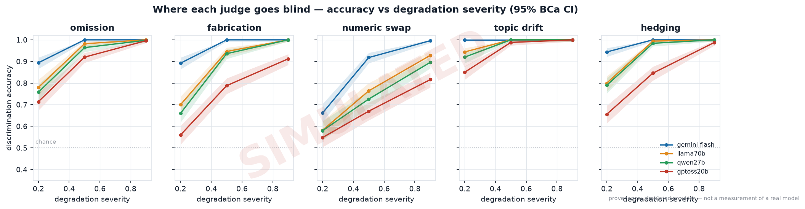
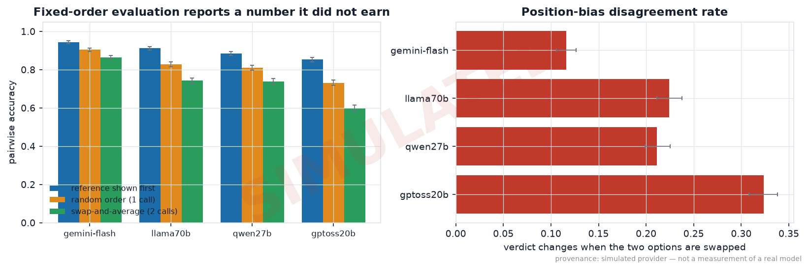
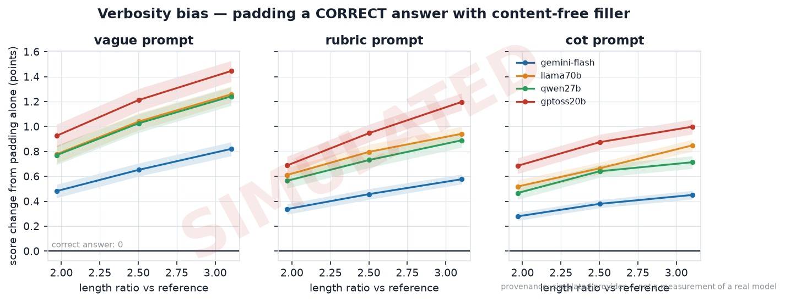
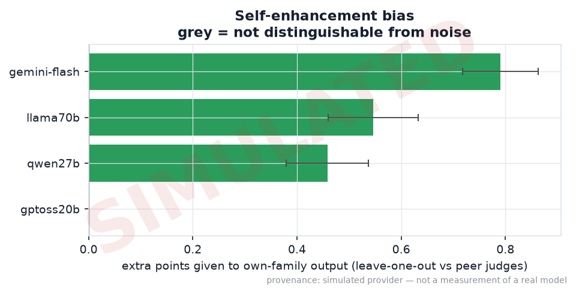
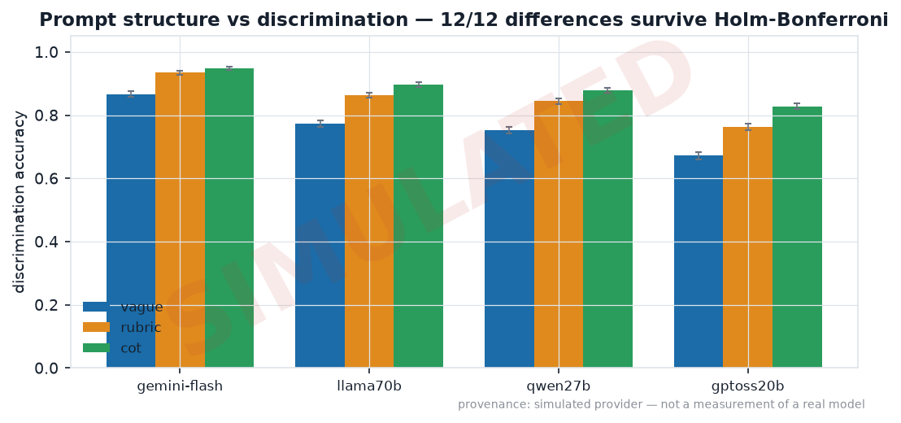
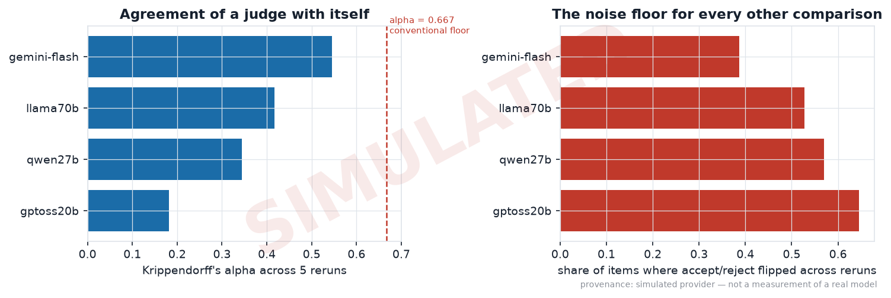
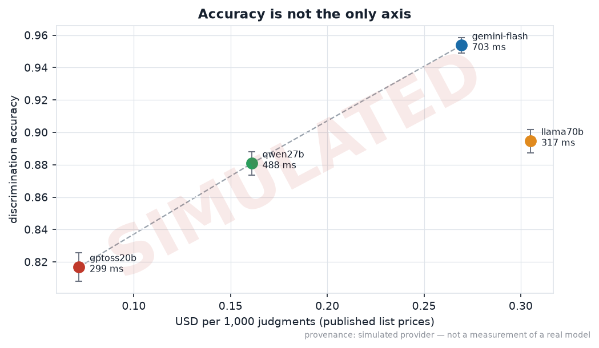
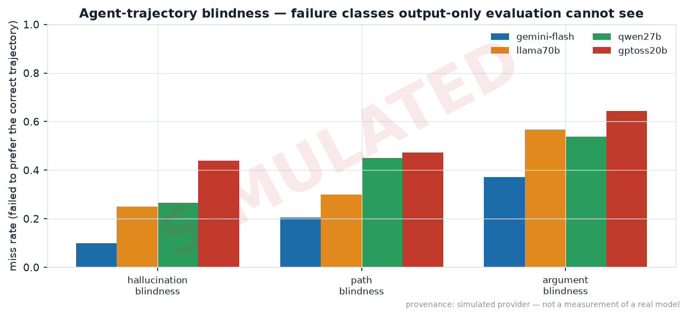
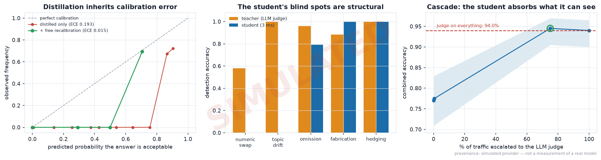
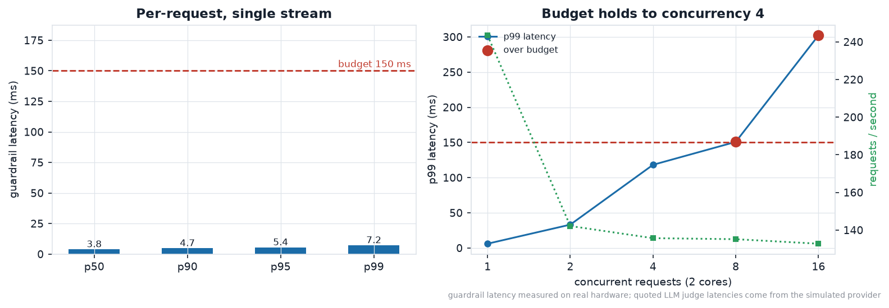

# Findings

**JudgeGuard — can you trust the judge?**
Aryan Meena · 2026 · [repository](https://github.com/RyanSingh0/judgeguard)

> **Provenance.** The numbers below were produced by the deterministic simulator described in
> `configs/simulator.yaml`. They demonstrate that the harness measures what it claims to measure;
> they are **not** measurements of Gemini, Llama, Qwen or GPT-OSS. Set
> `JUDGEGUARD_PROVIDER_MODE=live`, rerun the identical commands, and every number here is replaced
> by a measurement. The simulator's parameters are written down as explicit priors precisely so a
> live run can contradict them — and a contradiction would be the most interesting result in the
> project. Every figure produced in this mode is watermarked.

---

## Summary

Nine experiments, 7,500 text gold pairs, 540 trajectory comparisons per judge, 95% BCa bootstrap
intervals throughout, Holm–Bonferroni across the config grid.

1. **Judges are blindest to the errors that look most fluent.** Wrong numbers — stated verbatim in
   the source document the judge was given — were the worst-detected class for all four judges. At
   low severity the best judge was near chance: 66.2% [62.0, 70.4].
2. **On agent trajectories the gap becomes a hole.** Malformed tool arguments went undetected in
   37.2% to 64.4% of cases: a failure class output-only evaluation cannot reach by construction.
3. **Ranking well and deciding well are different properties.** The best judge lost 14 points
   purely to where its accept threshold sat, and distillation transmitted that miscalibration
   faithfully — ECE 0.193, cut to 0.015 by recalibrating on gold labels that cost nothing.

---

## 1. Discrimination: where each judge goes blind

`experiments/01_discrimination.py` · 500 items × 5 error degradations × 3 severities = 7,500 gold
pairs per judge · config `cot`, temperature 0

| judge | overall accuracy | topic drift | hedging | omission | fabrication | **numeric swap** |
|---|---|---|---|---|---|---|
| gemini-flash | **95.4%** [94.9, 95.8] | 100.0% | 98.1% | 96.5% | 96.4% | **85.9%** |
| llama70b | 89.5% [88.7, 90.2] | 98.1% | 93.1% | 92.1% | 88.2% | **75.8%** |
| qwen27b | 88.1% [87.3, 88.8] | 97.3% | 92.5% | 90.7% | 86.5% | **73.4%** |
| gptoss20b | 81.7% [80.8, 82.6] | 94.6% | 83.0% | 87.7% | 75.3% | **67.8%** |

**Numeric swap was the worst-detected class for every judge, without exception.** The column
ordering *is* the finding: detection tracks how much of the *surface* the error disturbs, not how
much of the *meaning* it destroys. Topic drift changes what the answer is about and is caught
95–100% of the time. Changing `11.7` to `15.2` changes whether the answer is true, leaves the
prose untouched, and is caught 68–86% of the time — **even though the correct value is printed in
the source record the judge was handed.** The information needed to catch it was in the prompt.

The severity sweep sharpens it. At severity 0.2 — a ~4% perturbation, the kind that survives a
careless copy-paste:

| judge | numeric swap @ 0.2 | @ 0.5 | @ 0.9 |
|---|---|---|---|
| gemini-flash | 66.2% [62.0, 70.4] | 91.8% | 99.6% |
| llama70b | 58.2% [53.8, 62.4] | 76.4% | 92.8% |
| qwen27b | 58.0% [53.6, 62.4] | 72.6% | 89.6% |
| gptoss20b | **54.8% [50.4, 59.0]** | 67.0% | 81.6% |

The weakest judge's interval at severity 0.2 reaches down toward chance. Spearman correlation
between severity and assigned score degrades in the same order (ρ = −0.78, −0.60, −0.54, −0.39):
the strongest judge's score tracks how badly the number is wrong; the weakest judge's barely does.

Tie rates ran 1.7%–2.7% and are counted as failures throughout — the conservative choice.

---

## 2. Position bias, and what swap-and-average actually buys

`experiments/02_position_bias.py` · 250 items × 5 degradations × 3 severities = 3,750 comparisons
per judge, each run in both orderings

| judge | order disagreement | ref shown first | random order | swap-and-average |
|---|---|---|---|---|
| gemini-flash | 11.6% [10.6, 12.6] | 94.3% | 90.4% | 86.4% |
| llama70b | 22.4% [21.1, 23.8] | 91.3% | 82.8% | 74.2% |
| qwen27b | 21.1% [19.9, 22.5] | 88.4% | 81.1% | 73.9% |
| gptoss20b | **32.3% [30.8, 33.8]** | 85.3% | 73.1% | **59.8%** |

**The weakest judge changed its verdict on nearly a third of comparisons purely because the two
options were swapped.**

The middle two columns are the uncomfortable part. A harness that always shows the reference first
reports an accuracy inflated by the bias it failed to control for: +3.9 pp [3.3, 4.6] for the
strongest judge, **+12.1 pp [11.1, 13.2]** for the weakest, every one significant at p < 0.001.

The last column is more uncomfortable still. Swap-and-average **lowers** every reported number, by
4.0 to 13.3 percentage points, because it doubles the API cost and then scores an ordering
disagreement as a miss instead of quietly resolving it:

> **The standard position-bias mitigation does not make a judge more accurate. It makes the
> accuracy you were already reporting less of an illusion.**

If your harness runs each comparison once, in a fixed order, the number on your dashboard is too
high, and this table says by how much.

---

## 3. Verbosity bias, in points

`experiments/03_verbosity_bias.py` · the padded text is the **unmodified reference** plus
content-free filler. No fact added, removed or altered. The correct score change is exactly zero.

Score change at 3.1× length, on the 1–10 scale:

| judge | `vague` | `rubric` | `cot` |
|---|---|---|---|
| gemini-flash | +0.82 [+0.76, +0.88] | +0.58 | +0.45 |
| llama70b | +1.26 [+1.19, +1.32] | +0.94 | +0.85 |
| qwen27b | +1.24 [+1.17, +1.32] | +0.89 | +0.71 |
| gptoss20b | **+1.45 [+1.36, +1.53]** | +1.20 | +1.00 |

Padding a correct answer to three times its length with sentences carrying no information raised
its score by up to **1.45 points out of 10**, and 85–94% of padded answers scored strictly higher
than the identical unpadded original.

Prompt structure helps but does not fix it: moving from `vague` to `cot` roughly halves the effect
for the strongest judge and cuts a third off it for the weakest. **No configuration brought any
judge to zero**, despite a rubric criterion explicitly stating that padding is a defect.

---

## 4. Self-enhancement bias

`experiments/04_self_enhancement.py` · 300 items, four generator families, leave-one-out estimator

Naively comparing a judge's score for its own family against other families confounds bias with
quality. So each judge's score for a response is compared against the mean score the **other**
judges gave the **same** response. Response quality cancels; judge-specific preference remains.

| judge | own-family advantage | significant |
|---|---|---|
| gemini-flash | **+0.79 pts** [+0.72, +0.86] | yes, p < 0.001 |
| llama70b | +0.55 [+0.46, +0.63] | yes, p < 0.001 |
| qwen27b | +0.46 [+0.38, +0.54] | yes, p < 0.001 |
| gptoss20b | +0.12 [+0.01, +0.23] | marginal, p = 0.03 |

Every judge favoured its own family, and the *strongest* judge showed the largest effect.
Discrimination ability and freedom from self-preference are not the same axis: a leaderboard built
by asking the best model to grade everyone will systematically flatter its own family by roughly
0.8 points.

---

## 5. Does prompt structure buy discrimination?

`experiments/05_rubric_ablation.py` · 400 items, three configs, fully paired

| judge | `vague` | `rubric` | `cot` | cot − vague |
|---|---|---|---|---|
| gemini-flash | 86.7% | 93.5% | 94.8% | **+8.2 pp** [+7.2, +9.1] |
| llama70b | 77.3% | 86.4% | 89.6% | +12.3 pp [+11.1, +13.6] |
| qwen27b | 75.3% | 84.5% | 88.0% | +12.7 pp [+11.4, +13.9] |
| gptoss20b | 67.2% | 76.4% | 82.8% | **+15.7 pp** [+14.2, +17.1] |

**All 12 pairwise config comparisons survived Holm–Bonferroni correction.** Structure is not a
placebo.

- **The effect is largest where the judge is weakest.** Prompt engineering substitutes for model
  capability, and the substitution rate is steepest at the bottom.
- **It is not free.** `cot` cost ~1.62M extra tokens, buying 0.005–0.010 accuracy points per 1,000
  extra tokens. That ratio, not the raw delta, is what belongs in a budget conversation.

---

## 6. Judges against themselves

`experiments/06_self_consistency.py` · 3,000 pairs, 5 reruns at temperature 0.7, `rubric`

| judge | Krippendorff α | two runs disagree on accept/reject | at least one flip in five | score SD |
|---|---|---|---|---|
| gemini-flash | 0.545 | 19.2% | 38.7% [36.9, 40.4] | 0.42 |
| llama70b | 0.417 | 25.5% | 52.7% | 0.56 |
| qwen27b | 0.344 | 27.4% | 57.0% | 0.61 |
| gptoss20b | **0.182** | **31.5%** | 64.6% [62.9, 66.2] | 0.76 |

No judge reached the conventional α ≥ 0.667 reliability floor. Run the same judge twice on the
same item and the accept/reject decision changes 19–32% of the time.

**This is the ceiling on everything else in this document.** An accuracy difference narrower than
a judge's own run-to-run variance is not measurable from a single run, and a leaderboard built
from single-sample judging is reporting noise at that resolution.

---

## 7. Accuracy is not the only axis

`experiments/07_cost_accuracy.py` · list prices, because every call ran on a free tier and
reporting $0 would make the comparison meaningless

| judge | tier | accuracy | USD / 1k judgments | mean latency | USD / 1k **correct** |
|---|---|---|---|---|---|
| gemini-flash | frontier | 95.4% | $0.269 | 703 ms | $0.282 |
| llama70b | open-weight | 89.5% | $0.305 | 317 ms | $0.341 |
| qwen27b | open-weight | 88.1% | $0.161 | 488 ms | $0.183 |
| gptoss20b | open-weight | 81.7% | **$0.072** | 299 ms | **$0.088** |

Three of four models sit on the Pareto frontier, so **the choice is a genuine trade rather than a
dominance ordering** — and `llama70b` is dominated on both axes, retaining 93.8% of the frontier
judge's accuracy while costing *more* per 1,000 judgments than the frontier model itself.

The operational conclusion is not "pick a different judge". It is that **no judge in this panel is
fast enough to run inline** — 299 ms is already past a 150 ms budget before the network is
involved, and the swap protocol doubles it. That is the argument for distillation.

---

## 8. Agent-trajectory blindness

`experiments/08_trajectory_blindness.py` · 60 deterministic tasks × 3 degradations × 3 severities
= 540 comparisons per judge, swap-and-average scoring

**Miss rate — the share of cases where the judge failed to prefer the correct trajectory:**

| judge | hallucination blindness (undefined tool called) | path blindness (right answer, wrong path) | **argument blindness** (wrong value, correct tool) |
|---|---|---|---|
| gemini-flash | 10.0% | 20.6% | **37.2%** |
| llama70b | 25.0% | 30.0% | **56.7%** |
| qwen27b | 26.7% | 45.0% | **53.9%** |
| gptoss20b | 43.9% | 47.2% | **64.4%** |

Detection accuracy for malformed arguments ran from 62.8% [55.6, 69.4] down to
35.6% [28.9, 42.8].

**Argument blindness is the worst class for every judge, by a wide margin.** The action space is
printed verbatim in the prompt, so `phantom_tool` is a lookup the judge can perform — and it is
the best-detected class. A wrong argument requires the judge to hold an execution model of the
tool and check a value against it. It has none, and the transcript reads as perfectly valid.

**This is precisely the failure that output-only evaluation cannot reach.** `silent_failure` makes
it explicit: the final answer is correct by construction, so any evaluator scoring only the output
marks it perfect — while 21–47% of the time the judge with full access to the trajectory also
failed to notice the path was broken.

**Trajectory-length bias is real and points the wrong way.** Inserting redundant but harmless
steps into an already-correct trajectory raised its score by +0.14 to +0.39 points (all intervals
excluding zero) — a judge rewarding an agent for taking a longer route to the same answer, in a
setting where every extra step is a real token cost and a real failure opportunity.

---

## 9. Distillation, calibration, and what a 5 ms model can and cannot see

`experiments/09_distill.py` · teacher selected by measured accuracy (`gemini-flash` / `cot`) ·
one reference against one sampled error variant per item · 600 train / 200 calibration / 200 test

### A methodological detour that changed the result

The first version trained on the battery's full cross-product: 1 reference to 15 error variants
per item. The student scored 94.8% — and was useless. At that class balance a *correctly
calibrated* model reports p(good) ≈ 0.06 for **any** unpadded text, the reference included, so it
blocked 83% of traffic and its accuracy was the base rate wearing a lab coat.

Two sampling fixes were needed, and both cost accuracy on paper while making the model worth
deploying: **one-to-one balance**, and **holding verbosity probes out of training** (a padded
reference carries label 1 and is trivially identifiable by its filler, which makes "contains
filler" the dominant positive feature). Recorded because the first version produced a
better-looking README.

### The teacher's score is not a decision

| evaluator | accuracy vs degradation ground truth | balanced accuracy |
|---|---|---|
| majority-class baseline | 51.0% | 0.500 |
| **teacher at the rubric's own 7.0 boundary** | **80.0%** [74.0, 85.0] | 0.796 |
| teacher at its best possible threshold (7.7) | 94.0% [90.0, 96.5] | 0.939 |
| distilled student (5 ms) | 77.0% [70.5, 82.5] | 0.770 |

The same judge that ranks a reference above a broken copy 95.4% of the time classifies at 80.0%
when its raw score is cut at the boundary its own rubric defines. Moving the cut to 7.7 recovers
**14 points** from an unchanged signal.

**Ranking well and deciding well are different properties, measured differently.** A judge
evaluated only on ranking accuracy can be shipped as an accept/reject gate and quietly lose 14
points, and nothing on a standard leaderboard would show it.

### Where the student inherits, and where it cannot follow

| degradation | teacher (LLM judge) | student (5 ms) |
|---|---|---|
| hedging | 100.0% | **100.0%** |
| fabrication | 88.2% | **100.0%** \* |
| reference (correctly allowed) | 99.0% | **100.0%** |
| omission | 95.8% | 79.2% |
| **numeric swap** | 57.9% | **0.0%** |
| **topic drift** (same domain) | 100.0% | **0.0%** |

\* *partly memorisation — `fabrication` draws from six fixed templates; see
[limitations §7b](limitations.md).*

The two zeros are structural, not tuning failures. A bag-of-n-grams model over the answer plus
coverage features against the source can detect *absolute* signatures (hedge words, filler,
missing source vocabulary) but cannot verify that a stated number matches the one in the record.
Same-domain topic drift substitutes clauses from a sibling item, leaving the vocabulary
distribution nearly unchanged.

**The student's worst class is also the judge's worst class.** Distillation is supposed to
transfer behaviour including blind spots, and here it over-transfers: 57.9% → 0.0%.

### As a guardrail, the numbers that matter are different

| metric | value |
|---|---|
| bad output caught | 53.1% |
| **block precision** | **100.0%** |
| **false-block rate** | **0.0%** |
| block rate | 26.0% |
| false-allow rate | 31.1% |

It never blocked a correct answer. For an inline gate that is the number that decides whether
anyone lets it near production — a guardrail that blocks good output is removed within a week
regardless of its accuracy. It catches a little over half of bad output for free, in 5 ms, and it
is honest about the rest.

### Distillation inherits calibration error — and that is fixable for free

| | ECE against ground truth |
|---|---|
| student, distilled from teacher labels only | **0.193** |
| after isotonic recalibration on 200 free gold labels | **0.015** |

A student fit purely on teacher labels emits probabilities meaning *"the teacher would accept
this"* — a faithful reproduction of a miscalibrated signal. Because degradation gold labels are
manufactured rather than annotated, they are free, and so is the recalibration.

**The labels being free is what makes the calibration free.** That is the underrated consequence
of manufacturing ground truth instead of buying it. (Fidelity to the teacher: 88.0% agreement,
AUC 0.808. Brier 0.158.)

### The honest architecture is a cascade, not a replacement

The student is 17.0 points behind its teacher (Δ = −17.0 pp, 95% CI [−23.0, −11.5], p < 0.001).
That gap is real and there is no interval to hide in. But it is concentrated in exactly two
classes the student cannot see, which suggests routing rather than replacement:

| escalated to the judge | combined accuracy | mean latency | cost |
|---|---|---|---|
| 0% (student only) | 77.0% [70.5, 82.5] | 5 ms | $0 |
| 0.5% | 77.5% [71.0, 83.0] | 9 ms | $0.001/1k |
| **75%** | **94.5% [90.5, 97.0]** | 532 ms | $0.189/1k |
| 100% (judge only) | 94.0% [90.0, 96.5] | 708 ms | $0.251/1k |

> Escalating 75% of traffic matched judge-only accuracy — 94.5% [90.5, 97.0] against
> 94.0% [90.0, 96.5], overlapping intervals — at 75% of the cost.

A 25% saving is a modest result and it is the one the data supports. The student can cheaply *rule
out* obvious defects; it cannot rule them *in*. Everything it allows still needs the judge, which
is precisely what a guardrail-plus-evaluator architecture is supposed to look like.

### One more asymmetry

Held-out padded references — correct answers that are merely three times longer — are allowed
**0% of the time**. The judges scored the same padding **up** by as much as +1.45 points (§3). The
judge has a pro-verbosity bias and the distilled student has an anti-verbosity bias, and neither is
neutral about length. Whether blocking padding is a defect depends on whether your rubric calls
padding a defect; ours does, which is the only reason this is not simply a bug.

---

## 10. Does the guardrail fit its budget?

`experiments/10_latency_bench.py` · **real measurement**, real model, real hardware (2 cores) ·
the simulator never enters this path

| | p50 | p95 | p99 |
|---|---|---|---|
| guardrail, single stream | 3.84 ms | 5.43 ms | **7.15 ms** |

Against a 150 ms p99 budget: **met, with 143 ms of headroom**, and 78× faster than the fastest LLM
judge in the panel. Batched (the async path) the cost is 0.34 ms per item.

The concurrency sweep is the deployable result:

| concurrent requests | p99 | throughput | within budget |
|---|---|---|---|
| 1 | 6.1 ms | 243 rps | yes |
| 2 | 33.2 ms | 142 rps | yes |
| 4 | 118.2 ms | 136 rps | yes |
| 8 | 150.8 ms | 135 rps | **no** |
| 16 | 302.2 ms | 133 rps | **no** |

One p99 number is a machine fingerprint. *"The budget holds to concurrency 4 on 2 cores, and past
that the queue owns the tail"* is a sizing decision — and it says the fix is horizontal replicas,
not a smaller model, because throughput plateaus at ~135 rps while latency keeps climbing.

---

## What I would do next

- **Run it live.** Every number above is a prior awaiting contradiction. The interesting outcome is
  disagreement with `configs/simulator.yaml`.
- **A template-disjoint distillation split.** `fabrication` and `verbosity` draw from six fixed
  templates each, so part of the student's perfect score there is memorisation.
- **Give the student exact numeric matching.** The source record states the values, so a 20-line
  rule could catch what the LLM judge misses 42% of the time. If a 5 ms classifier beats a
  frontier judge on a whole error class, that is a stronger result than anything here.
- **Widen the trajectory action space.** Four deterministic tools make the gold label unambiguous
  and the result narrow. Whether argument blindness persists with stateful tools is the question
  that matters for real agents.
- **Human validation of the gold labels.** ~200 pairs rated by 3 annotators would let the
  degradation construct be validated rather than assumed. See `limitations.md` §2.
